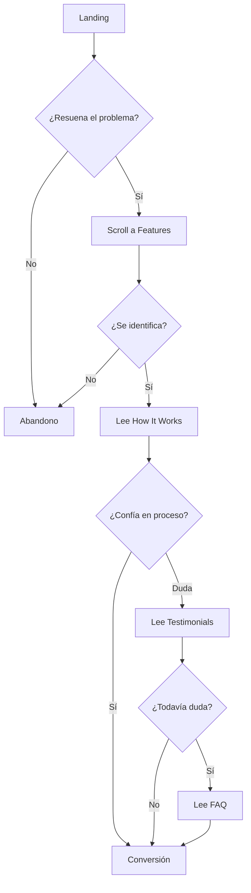

# 🌟 HERENCIA CÓSMICA - BRAND & COPY GUIDE

> **Guía Completa de Marca, Copy y Diseño**  
> Versión 1.0 | Enero 2026

---

## 📑 Índice

1. [Brand Overview](#1-brand-overview)
2. [Messaging Strategy](#2-messaging-strategy)
3. [Landing Page Architecture](#3-landing-page-architecture)
4. [Copy Breakdown](#4-copy-breakdown)
5. [Design System](#5-design-system)
6. [Visual Identity](#6-visual-identity)
7. [Conversion Optimization](#7-conversion-optimization)
8. [SEO & Metadata](#8-seo--metadata)
9. [Technical Specs](#9-technical-specs)
10. [Brand Guidelines](#10-brand-guidelines)

---

## 1. BRAND OVERVIEW

### 1.1 ¿Qué es Herencia Cósmica?

**Herencia Cósmica** es una experiencia de autoconocimiento que utiliza la carta natal como un **mapa de conciencia familiar**, no como herramienta predictiva, sino como espejo de patrones heredados.

**Definición en una línea:**
> "Tu carta natal como mapa de patrones heredados que hoy influyen en tu dinero, relaciones y seguridad emocional."

### 1.2 Propuesta de Valor Única (UVP)

```
No predecimos tu futuro.
Revelamos el guion emocional que heredaste 
y cómo impacta tus decisiones hoy.
```

**Diferenciadores clave:**

| Herencia Cósmica | Astrología Tradicional |
|------------------|------------------------|
| ✅ Enfoque terapéutico | ❌ Enfoque predictivo |
| ✅ Patrones familiares específicos | ❌ Análisis genérico de personalidad |
| ✅ Lenguaje claro y directo | ❌ Tecnicismos astrológicos |
| ✅ Aplicación práctica inmediata | ❌ Información abstracta |
| ✅ Liberación de culpa | ❌ Definición de destino |

### 1.3 Posicionamiento: Terapéutico vs Predictivo

**🎯 Posicionamiento Central:**

Herencia Cósmica NO es:
- ❌ Astrología predictiva
- ❌ Lectura de futuro
- ❌ Definición de destino
- ❌ Análisis completo de carta natal

Herencia Cósmica SÍ es:
- ✅ Mapa de patrones heredados
- ✅ Comprensión de lealtades invisibles
- ✅ Identificación de mandatos familiares
- ✅ Herramienta de orden y claridad
- ✅ Camino hacia la responsabilidad personal

**Frase clave de marca:**
> "No puedes cambiar lo que no sabes que estás obedeciendo."

### 1.4 Público Objetivo: Persona "Sofía"

#### 👤 Perfil Demográfico

- **Nombre:** Sofía
- **Edad:** 30-45 años
- **Género:** Principalmente mujeres (80%), hombres conscientes (20%)
- **Ubicación:** Urbana, LATAM (Costa Rica, México, Argentina, Colombia)
- **Educación:** Universitaria, profesionales o emprendedoras
- **Situación:** En transición o búsqueda de claridad

#### 🎭 Perfil Psicográfico

**Estado Emocional:**
- Cansada de esforzarse sin ver resultados
- Frustrada por repetir patrones
- Culpable cuando piensa en priorizarse
- Confundida sobre por qué no avanza

**Búsquedas y Necesidades:**
- 🔍 **Claridad:** Entender POR QUÉ le pasa lo que le pasa
- 🎯 **Control:** Sentir que puede elegir distinto
- 💚 **Validación:** Saber que no está "rota"
- 🗝️ **Liberación:** Dejar de luchar contra sí misma

**Objeciones y Miedos:**
- "¿Esto definirá mi destino?"
- "¿Implicará culpar a mi familia?"
- "¿Necesito saber de astrología?"
- "¿Es muy esotérico/New Age?"

#### 🎯 Pain Points Específicos

1. **Dinero y Trabajo:**
   - Dificultad para sostener estabilidad económica
   - Sensación de "techo de cristal"
   - Culpa al ganar más que sus padres
   - Ciclos de abundancia y escasez

2. **Relaciones:**
   - Siempre termina dando más
   - Atrae parejas con las mismas dinámicas
   - Dificultad para poner límites
   - Miedo a decepcionar

3. **Familia:**
   - Carga con responsabilidades que no son suyas
   - Rol de "cuidadora" o "salvadora"
   - Dificultad para diferenciarse
   - Lealtad invisible a sacrificios parentales

4. **Autoestima y Seguridad:**
   - Sensación de no merecer
   - Miedo a destacar o ser visible
   - Autocrítica constante
   - Dificultad para recibir

### 1.5 Misión y Enfoque

**Misión:**
> Ayudar a personas conscientes a comprender los patrones heredados que operan en silencio, para que puedan ordenar su vida desde la claridad y no desde la repetición automática.

**Enfoque:**
- 🧠 Comprensión, no culpa
- 🔓 Liberación, no encasillamiento  
- 🎯 Orden, no caos
- 💡 Conciencia, no victimización
- 🌱 Responsabilidad, no resignación

---

## 2. MESSAGING STRATEGY

### 2.1 Tono de Voz y Personalidad de Marca

#### 🎨 Dimensiones del Tono

| Dimensión | Posición | Descripción |
|-----------|----------|-------------|
| **Formal ↔️ Casual** | 40% Formal | Profesional pero accesible |
| **Serio ↔️ Divertido** | 70% Serio | Profundo pero sin dramatismo |
| **Respetuoso ↔️ Irreverente** | 90% Respetuoso | Sensible a temas familiares |
| **Entusiasta ↔️ Realista** | 80% Realista | Honesto y directo |

#### 🗣️ Características del Tono

**SÍ somos:**
- ✅ **Directos:** Sin rodeos, llamamos las cosas por su nombre
- ✅ **Empáticos:** Validamos el dolor sin dramatizarlo
- ✅ **Claros:** Lenguaje sencillo, sin tecnicismos
- ✅ **Respetuosos:** Honramos la historia familiar
- ✅ **Empoderantes:** Enfocados en la responsabilidad personal

**NO somos:**
- ❌ Místicos o esotéricos en exceso
- ❌ Dramáticos o victimizantes
- ❌ Técnicos o académicos
- ❌ Culpabilizadores
- ❌ Vagos o abstractos

#### 📝 Ejemplos Comparativos

| Situación | ❌ NO escribir | ✅ SÍ escribir |
|-----------|----------------|----------------|
| Hablar de patrones | "El cosmos te señala un camino mágico..." | "Tu carta revela patrones heredados que operan en silencio." |
| Mencionar familia | "Tu familia es tóxica y te bloquea" | "En tu sistema familiar existen lealtades invisibles." |
| Sobre el cambio | "¡Transforma tu vida ahora!" | "Comprender la raíz te permite elegir distinto." |
| Llamado a acción | "¡Descubre tu destino!" | "Descubre tu herencia cósmica." |

### 2.2 Mensajes Clave (Core Messages)

#### 🎯 Mensaje Principal

```
No es falta de voluntad.
Es una herencia emocional que actúa en silencio.
```

#### 💬 Mensajes Secundarios

1. **Sobre los patrones:**
   > "No puedes cambiar lo que no sabes que estás obedeciendo."

2. **Sobre la familia:**
   > "No heredamos solo genes. Heredamos roles, mandatos y límites emocionales."

3. **Sobre la carta natal:**
   > "Tu carta natal como mapa de conciencia, no como definición de destino."

4. **Sobre la liberación:**
   > "Comprender tu herencia invisible no te encasilla. Te libera."

5. **Sobre la responsabilidad:**
   > "Tu vida no empezó contigo, pero puede ordenarse contigo."

### 2.3 Palabras y Conceptos Clave

#### ✅ USAR (Vocabulario de Marca)

**Conceptos Centrales:**
- Herencia cósmica / Herencia emocional
- Patrones heredados
- Lealtades invisibles
- Mandatos familiares
- Guion emocional
- Mapa de conciencia
- Orden y claridad

**Verbos de Acción:**
- Comprender (no "descubrir mágicamente")
- Ordenar (no "sanar")
- Revelar (no "predecir")
- Liberar (no "romper")
- Elegir (no "destinar")

**Adjetivos Permitidos:**
- Invisible / Silencioso
- Heredado / Transgeneracional
- Consciente / Inconsciente
- Claro / Directo
- Responsable / Personal

#### ❌ EVITAR (Palabras que no resuenan con la marca)

**Conceptos Místicos Extremos:**
- ❌ Destino / Karma
- ❌ Energías / Vibración
- ❌ Magia / Milagros
- ❌ Universo conspira
- ❌ Alma gemela / Misión divina

**Lenguaje Victimizante:**
- ❌ Familia tóxica
- ❌ Estás maldito/a
- ❌ No tienes salida
- ❌ Culpa de tus padres
- ❌ Bloqueado/a para siempre

**Tecnicismos Sin Contexto:**
- ❌ Cuadratura de Saturno (sin explicar)
- ❌ Casa 4 en Capricornio (sin contexto)
- ❌ Ascendente en oposición (muy técnico)

### 2.4 Ángulo Emocional: Pain Points → Beneficios

#### 🔴 Pain Points → 🟢 Beneficios

| Pain Point | Beneficio Ofrecido |
|------------|-------------------|
| "Me esfuerzo pero algo siempre me frena" | Identificas QUÉ te frena (el patrón heredado) |
| "Repito los mismos errores en relaciones/trabajo" | Comprendes POR QUÉ repites (el mandato familiar) |
| "Siento culpa al priorizarme" | Reconoces que la culpa no es tuya (lealtad invisible) |
| "Cargo responsabilidades que no son mías" | Ordenas qué es tuyo y qué no (claridad de roles) |
| "Tengo miedo de destacar o tener más" | Entiendes el origen del miedo (sacrificio heredado) |

#### 🎭 Transformación Emocional

**Estado Inicial (Before):**
- 😰 Confusión: "¿Por qué me pasa esto?"
- 😞 Culpa: "Algo está mal en mí"
- 😫 Agotamiento: "Ya intenté de todo"
- 😔 Resignación: "Así soy yo"

**Estado Final (After):**
- 💡 Claridad: "Ahora entiendo por qué"
- 🕊️ Alivio: "No es culpa mía"
- 🎯 Empoderamiento: "Puedo elegir distinto"
- 🌱 Esperanza: "Esto puede ordenarse"

---

## 3. LANDING PAGE ARCHITECTURE

### 3.1 Estructura de 6 Secciones

La landing page está diseñada con un flujo de conversión estratégico que guía al usuario desde el reconocimiento del problema hasta la acción.

```
┌─────────────────────────────────────┐
│  1. HERO                            │  ← Atención: Hook emocional
│  "¿Por qué repites patrones?"      │
└─────────────────────────────────────┘
           ↓
┌─────────────────────────────────────┐
│  2. FEATURES (El Problema)          │  ← Validación: Dolor específico
│  "Lealtades invisibles"            │
└─────────────────────────────────────┘
           ↓
┌─────────────────────────────────────┐
│  3. HOW IT WORKS                    │  ← Solución: Proceso claro
│  "3 pasos simples"                 │
└─────────────────────────────────────┘
           ↓
┌─────────────────────────────────────┐
│  4. TESTIMONIALS                    │  ← Prueba social: Alivio
│  "Lo que otros experimentaron"     │
└─────────────────────────────────────┘
           ↓
┌─────────────────────────────────────┐
│  5. FAQ                             │  ← Objeciones: Derribar miedos
│  "Preguntas frecuentes"            │
└─────────────────────────────────────┘
           ↓
┌─────────────────────────────────────┐
│  6. CTA FINAL                       │  ← Acción: Conversión
│  "Descubrir mi herencia"           │
└─────────────────────────────────────┘
```

### 3.2 Objetivo de Cada Sección

| Sección | Objetivo Principal | Objetivo Secundario | Métricas Clave |
|---------|-------------------|---------------------|----------------|
| **Hero** | Captar atención con pregunta directa | Generar identificación inmediata | Scroll rate, Time on page |
| **Features** | Validar el dolor específico | Nombrar las lealtades invisibles | Engagement, Read depth |
| **How It Works** | Reducir fricción del proceso | Mostrar simplicidad | Click to CTA |
| **Testimonials** | Generar confianza y prueba social | Mostrar transformación emocional | Trust indicators |
| **FAQ** | Eliminar objeciones | Educar sobre el enfoque | Bounce rate reduction |
| **CTA Final** | Conversión | Reforzar mensaje de liberación | Conversion rate |

### 3.3 Flow de Conversión

#### 🎯 Journey del Usuario

**Fase 1: AWARENESS (Hero + Features)**
- Usuario llega → Ve pregunta que resuena
- Se identifica con patrones → Validación emocional
- Reconoce el dolor → "Esto es lo que me pasa"

**Fase 2: CONSIDERATION (How It Works + Testimonials)**
- Entiende la solución → "Es simple y claro"
- Ve testimonios → "Otros lo intentaron y funcionó"
- Confía en el proceso → "Esto puede ayudarme"

**Fase 3: DECISION (FAQ + CTA)**
- Resuelve dudas → "No es lo que temía"
- Se siente seguro → "100% gratuito, sin riesgo"
- Toma acción → Click en CTA

#### 📍 Puntos de Decisión



### 3.4 CTAs y Enlaces

#### 🔗 CTA Principal

**URL:** `https://app.herenciacosmica.com/ver-reporte-gratuito`

**Copy variations (por contexto):**

| Ubicación | Copy del Botón | Contexto |
|-----------|----------------|----------|
| **Hero** | 🎁 Descubrir mi Herencia Cósmica GRATIS | Primer impacto, con emoji |
| **How It Works** | Descubrir mi Herencia Cósmica | Después de explicar proceso |
| **CTA Final** | Descubrir mi Herencia Cósmica ahora | Urgencia suave |

**Elementos de soporte del CTA:**
- ✅ "100% Gratuito"
- ✅ "Sin tarjeta de crédito"
- ✅ "Resultados inmediatos"

#### 📊 Trust Indicators (Presentes en múltiples secciones)

```
+40 Lecturas realizadas | 4.9★ Calificación | 24/7 Disponible
```

### 3.5 Navegación y Estructura Técnica

#### 🗂️ IDs de Sección (para navegación)

```html
#inicio    → Hero
#detalles  → Features (Problema + Qué es HC)
#como-funciona → How It Works
#testimonios → Testimonials
#FAQ → Preguntas Frecuentes
(CTA no tiene ID, es la última sección)
```

#### 🔄 Scroll Behavior

- **Smooth scroll** habilitado globalmente
- **Scroll margin-top:** 100px (para compensar header fijo)
- **Scroll indicator** animado en Hero (bounce animation)

---

## 4. COPY BREAKDOWN

### 4.1 Sección HERO

#### 📍 Propósito
Captar atención inmediata con una pregunta que resuene emocionalmente y genere identificación instantánea.

#### 🎯 Elementos Clave

**1. Brand Name + Tagline**
```
Herencia Cósmica
[Línea decorativa: mystical-gradient]
```

**2. Main Headline (H2)**
```
¿Por qué sigues repitiendo patrones que prometiste no repetir,
incluso cuando haces todo "bien"?
```
- **Estrategia:** Pregunta directa que desafía la autoculpa
- **Hook emocional:** "prometiste no repetir" (dolor + intención fallida)
- **Especificidad:** "incluso cuando haces todo bien" (validación del esfuerzo)

**3. Subheadline 1**
```
No es falta de voluntad. No es que no te esfuerces lo suficiente.
```
- **Función:** Liberar culpa inmediatamente
- **Patrón:** Negación doble para validar

**4. Body Copy - Revelación**
```
Es una herencia emocional y familiar que actúa en silencio.

Desde antes de que tuvieras palabras, aprendiste reglas invisibles sobre 
el dinero, el amor, el trabajo y tu lugar en el mundo. Esas reglas no se 
cuestionan: se obedecen.
```
- **Concepto clave:** "Herencia emocional"
- **Especificidad:** Dinero, amor, trabajo, lugar en el mundo
- **Insight:** "No se cuestionan: se obedecen"

**5. Value Proposition**
```
Tu carta natal revela esos patrones heredados y muestra cómo hoy influyen 
en tu estabilidad económica, tus relaciones, tu rol familiar y tu seguridad 
emocional.
```
- **Solución:** Carta natal como herramienta
- **Beneficios tangibles:** 4 áreas específicas

**6. CTA Principal**
```
🎁 Descubrir mi Herencia Cósmica GRATIS
```
- **Emoji:** Regalo (genera reciprocidad)
- **Personalización:** "mi" Herencia
- **Incentivo:** GRATIS en mayúsculas

**7. Trust Line (bajo el CTA)**
```
100% Gratuito • Sin tarjeta de crédito • Resultados inmediatos
```

**8. Social Proof Stats (Grid 3 columnas)**
```
+40                    4.9★                    24/7
Lecturas realizadas    Calificación promedio   Disponible siempre
```

---

### 4.2 Sección FEATURES (El Problema + La Solución)

Esta sección está dividida en 2 sub-secciones:

#### 📍 PARTE 1: El Problema

**Headline:**
```
El problema que nadie te explicó
```

**Intro:**
```
Muchas personas viven con la sensación de que:
```

**Problem List (4 puntos en glass-cards):**
```
• Se esfuerzan, pero algo siempre las frena.
• Cambian de pareja, de trabajo o de estrategia… y la historia se repite.
• Cargan con responsabilidades que no saben de dónde vienen.
• Sienten culpa al pensar en priorizarse o tener más que su familia.
```
- **Estrategia:** Dolor progresivo desde el síntoma hasta la culpa familiar

**Transición:**
```
Esto no es casualidad.

En cada sistema familiar existen lealtades invisibles:
```

**Lealtades Invisibles (Grid 4 columnas con emojis):**

| Emoji | Título | Función |
|-------|--------|---------|
| 😰 | Miedos heredados | Ansiedad transgeneracional |
| ⚖️ | Sacrificios normalizados | Patrones de auto-sabotaje |
| 🤫 | Silencios que pesan | Secretos familiares |
| 😔 | Culpa por destacar | Límite de éxito heredado |

**Cierre:**
```
No heredamos solo genes.
Heredamos roles, mandatos y límites emocionales.
```

---

#### 📍 PARTE 2: ¿Qué es Herencia Cósmica?

**Headline:**
```
¿Qué es Herencia Cósmica?
```

**Definición Principal:**
```
Herencia Cósmica es una experiencia de autoconocimiento que utiliza la 
carta natal como un mapa de conciencia, no para predecir el futuro, sino 
para mostrar el guion emocional y familiar que aprendiste a vivir.
```

**Diferenciación:**
```
Aquí no se analizan todos los aspectos de tu carta.

Nos enfocamos exclusivamente en los patrones heredados que hoy impactan:
```

**Áreas de Impacto (Grid 2x2):**
```
💰 Dinero y trabajo
❤️ Relaciones de pareja
👨‍👩‍👧‍👦 Rol dentro de la familia
🛡️ Seguridad emocional y valía
```

**Objetivo:**
```
El objetivo no es juzgarte ni señalar culpables.
Es ayudarte a comprender la raíz, para que dejes de luchar contigo misma.
```

**Grid de Descubrimientos (4 columnas):**

**1. Herencia emocional 🧬**
```
Identifica miedos, culpas y sacrificios heredados que condicionan 
tus decisiones diarias.

→ Por qué reaccionas como reaccionas
```

**2. Linaje familiar 👨‍👩‍👧‍👦**
```
Comprende el rol que asumiste en tu familia y cómo ese papel sigue 
influyendo en tu vida adulta.

→ Por qué te cuesta soltar responsabilidades
```

**3. Propósito heredado 🌟**
```
Reconoce qué expectativas familiares cargas y cuáles no te corresponden.

→ Por qué dudas al elegir distinto
```

**4. Orden y claridad 🔮**
```
Empieza a tomar decisiones desde la conciencia, no desde la 
repetición automática.

→ Qué empieza a cambiar cuando lo ves
```

---

### 4.3 Sección HOW IT WORKS

#### 📍 Propósito
Reducir fricción mostrando que el proceso es simple y no requiere conocimientos previos.

**Headline:**
```
¿Cómo Funciona?
```

**Subheadline:**
```
No es un análisis genérico. La lectura se adapta a ti y a tu momento actual.
```

**Proceso de 3 Pasos (Grid de 3 columnas):**

**Paso 1:**
```
[Círculo con número: 1]

Ingresa tus Datos

Fecha y lugar de nacimiento. No necesitas conocimientos previos.
```

**Paso 2:**
```
[Círculo con número: 2]

Analizamos tu Carta Natal

La app prioriza únicamente los indicadores relacionados con patrones 
heredados, historia familiar y bloqueos recurrentes.
```

**Paso 3:**
```
[Círculo con número: 3]

Recibe tu Interpretación

Obtendrás una lectura clara, directa y sin lenguaje técnico, enfocada 
en comprender:
```

**Lo que Comprenderás (Lista en glass-card):**
```
• Por qué se repiten ciertos patrones
• Qué los sostiene a nivel inconsciente
• Qué puedes empezar a ordenar
```

**CTA Secundario:**
```
Descubrir mi Herencia Cósmica

100% Gratuito • Sin tarjeta de crédito • Resultados inmediatos
```

---

### 4.4 Sección TESTIMONIALS

#### 📍 Propósito
Generar confianza mediante prueba social enfocada en ALIVIO y COMPRENSIÓN, no en resultados mágicos.

**Headline:**
```
Lo que dicen quienes ya hicieron su lectura
```

**Subheadline:**
```
Personas que encontraron claridad y alivio al comprender sus patrones.
```

**Testimonial 1: Sofía M., 35 años**
```
★★★★★

"Pensé que el problema era yo. Entender mi herencia me devolvió paz."
```
- **Insight:** Auto-culpa → Paz
- **Foco:** Liberación de culpa

**Testimonial 2: Laura P., 42 años**
```
★★★★★

"Dejé de culparme por no avanzar. Ahora sé qué parte de mí estaba 
cargando con demasiado."
```
- **Insight:** Culpa por estancamiento → Identificación de carga
- **Foco:** Claridad sobre responsabilidades

**Testimonial 3: Carla R., 38 años**
```
★★★★★

"Me dio claridad y alivio. Entendí por qué siempre repetía lo mismo 
en el trabajo y en mis relaciones."
```
- **Insight:** Patrones repetitivos → Comprensión
- **Foco:** Aplicación práctica en 2 áreas

**Stats (Grid 3 columnas):**
```
97%              4.9★              24/7
Satisfacción     Calificación      Disponible
```

---

### 4.5 Sección FAQ

#### 📍 Propósito
Eliminar objeciones específicas relacionadas con destino, culpa familiar, astrología predictiva y tecnicismos.

**Headline:**
```
Preguntas Frecuentes
```

**Subheadline:**
```
Resolvemos las dudas más comunes sobre tu lectura de Herencia Cósmica.
```

**FAQ 1: ¿Esto define mi destino?**
```
No. Muestra lo que ha estado operando en automático para que puedas 
elegir distinto. La carta natal revela patrones heredados, pero tú tienes 
el poder de ordenarlos y tomar decisiones conscientes desde la comprensión.
```
- **Objeción:** Fatalismo
- **Respuesta:** Empoderamiento

**FAQ 2: ¿Necesito saber mi hora exacta de nacimiento?**
```
No es obligatorio. La lectura se adapta a la información disponible. Si 
tienes la hora exacta, la interpretación puede ser más específica, pero 
si no la tienes, aún podemos identificar los patrones heredados más 
importantes que influyen en tu vida.
```
- **Objeción:** Barrera técnica
- **Respuesta:** Flexibilidad

**FAQ 3: ¿Es astrología predictiva?**
```
No. Es una lectura terapéutica orientada a patrones heredados y conciencia 
emocional. No predecimos el futuro. Te ayudamos a comprender el origen de 
tus patrones para que puedas tomar decisiones más conscientes y alineadas 
con quien realmente quieres ser.
```
- **Objeción:** Confusión con astrología tradicional
- **Respuesta:** Posicionamiento terapéutico

**FAQ 4: ¿Esto implica culpar a mi familia?**
```
No. Se trata de comprender, no de señalar. El enfoque es orden y 
responsabilidad personal. Comprender tu herencia emocional no busca culpar 
a nadie, sino liberarte de patrones que no son tuyos para que puedas vivir 
con mayor claridad y autenticidad.
```
- **Objeción:** Miedo a traicionar a la familia
- **Respuesta:** Respeto + liberación

**FAQ 5: ¿Qué tan rápido recibiré mi lectura?**
```
Tu lectura estará lista de forma inmediata. Una vez que ingreses tus datos 
de nacimiento, el sistema genera tu carta natal y la interpretación 
personalizada al instante. Podrás comenzar a explorar tus patrones 
heredados en cuestión de minutos.
```
- **Objeción:** Tiempo de espera
- **Respuesta:** Gratificación inmediata

**FAQ 6: ¿Necesito conocimientos de astrología?**
```
Para nada. La lectura está diseñada en lenguaje claro y cotidiano, sin 
tecnicismos astrológicos. No necesitas saber qué es un ascendente o una 
casa astrológica. Todo está explicado de forma accesible, enfocado en que 
puedas comprender y aplicar la información a tu vida diaria.
```
- **Objeción:** Complejidad técnica
- **Respuesta:** Accesibilidad

---

### 4.6 Sección CTA FINAL

#### 📍 Propósito
Conversión final con mensaje de cierre que refuerza la idea de orden y liberación.

**Main Headline:**
```
Tu vida no empezó contigo, pero puede ordenarse contigo
```
- **Insight poderoso:** Reconoce la herencia pero empodera la acción

**Subheadline 1:**
```
Seguir intentando cambiar sin entender la raíz es agotador
```
- **Validación:** Reconoce el cansancio

**Subheadline 2:**
```
Comprender tu herencia invisible no te encasilla. Te libera.
```
- **Reframe:** Comprensión = Liberación

**CTA Final:**
```
Descubrir mi Herencia Cósmica ahora
```
- **Urgencia suave:** "ahora"

**Trust Badge (glass-card):**
```
100% Gratuito • Sin compromisos • Resultados inmediatos
```

**Trust Icons (con SVG):**
```
🛡️ 100% Seguro
ℹ️ Sin Compromisos
⏰ Resultados Inmediatos
```

---

## 5. DESIGN SYSTEM

### 5.1 Paleta de Colores

#### 🎨 Colores Principales (Mystical Palette)

| Color | Hex Code | RGB | Uso Principal |
|-------|----------|-----|---------------|
| **Mystical Purple** | `#8B5CF6` | rgb(139, 92, 246) | Gradientes, CTA, texto destacado |
| **Mystical Indigo** | `#6366F1` | rgb(99, 102, 241) | Backgrounds, efectos |
| **Mystical Pink** | `#EC4899` | rgb(236, 72, 153) | Gradientes, acentos |
| **Mystical Gold** | `#F59E0B` | rgb(245, 158, 11) | Gradientes finales, estrellas |
| **Light Purple** | `#C084FC` | rgb(192, 132, 252) | Hover states, variaciones |
| **Deep Purple** | `#6B46C1` | rgb(107, 70, 193) | Sombras, depth |
| **Cosmic Blue** | `#1E40AF` | rgb(30, 64, 175) | Backgrounds profundos |
| **Star Gold** | `#FCD34D` | rgb(252, 211, 77) | Estrellas, detalles |

#### 🌌 Colores de Background

| Capa | Colores | Hex Codes | Propósito |
|------|---------|-----------|-----------|
| **Base Purple** | Indigo 900 | `#1e1b4b` | Base del cosmic background |
| **Mid Purple** | Indigo 800 | `#312e81` | Transición 25% |
| **Deep Purple** | Purple 900 | `#4c1d95` | Centro 50% |
| **Rich Purple** | Purple 800 | `#581c87` | Transición 75% |
| **Dark Purple** | Purple 950 | `#3b0764` | Final 100% |

#### 🎨 Código CSS de Colores

```css
/* Tailwind Config - Custom Colors */
colors: {
  mystical: {
    purple: '#8B5CF6',
    indigo: '#6366F1',
    pink: '#EC4899',
    gold: '#F59E0B',
    'light-purple': '#C084FC',
    'deep-purple': '#6B46C1',
    'cosmic-blue': '#1E40AF',
    'star-gold': '#FCD34D'
  }
}
```

#### 🌈 Gradientes de Marca

**1. Mystical Gradient (Principal)**
```css
background: linear-gradient(135deg, #8B5CF6 0%, #EC4899 50%, #F59E0B 100%);
```
- **Uso:** Botones CTA, texto mystical, líneas decorativas
- **Dirección:** 135deg (diagonal)
- **Paradas:** Purple → Pink → Gold

**2. Cosmic Gradient (Alternativo)**
```css
background: linear-gradient(135deg, #667eea 0%, #764ba2 100%);
```
- **Uso:** Backgrounds secundarios
- **Dirección:** 135deg

**3. Background Cosmic (Hero)**
```css
background: linear-gradient(135deg, 
  #1e1b4b 0%, 
  #312e81 25%, 
  #4c1d95 50%, 
  #581c87 75%, 
  #3b0764 100%
);
```

### 5.2 Tipografías

#### 📝 Font Families

**1. Cormorant Garamond (Serif - Títulos)**
```css
font-family: 'Cormorant Garamond', serif;
```
- **Google Fonts URL:** 
```
https://fonts.googleapis.com/css2?family=Cormorant+Garamond:ital,wght@0,300;0,400;0,500;0,600;0,700;1,400&display=swap
```

**Pesos disponibles:**
- 300 (Light)
- 400 (Regular)
- 500 (Medium)
- 600 (SemiBold)
- 700 (Bold)
- 400 Italic

**2. Inter (Sans-serif - Cuerpo)**
```css
font-family: 'Inter', sans-serif;
```
- **Google Fonts URL:**
```
https://fonts.googleapis.com/css2?family=Inter:wght@300;400;500;600;700&display=swap
```

**Pesos disponibles:**
- 300 (Light)
- 400 (Regular)
- 500 (Medium)
- 600 (SemiBold)
- 700 (Bold)

#### 📏 Jerarquía Tipográfica

| Elemento | Familia | Tamaño | Peso | Uso |
|----------|---------|--------|------|-----|
| **H1 (Brand)** | Cormorant | 3rem (48px) / 4rem (64px) MD | 700 Bold | Nombre de marca en Hero |
| **H2 (Headline)** | Cormorant | 1.875rem (30px) / 2.25rem (36px) MD | 600 SemiBold | Headlines principales |
| **H3 (Section)** | Cormorant | 1.5rem (24px) / 2rem (32px) MD | 600 SemiBold | Títulos de sección |
| **Body Large** | Inter | 1.25rem (20px) / 1.5rem (24px) MD | 400 Regular | Subheadlines importantes |
| **Body** | Inter | 1rem (16px) / 1.125rem (18px) MD | 400 Regular | Texto general |
| **Small** | Inter | 0.875rem (14px) | 400 Regular | Disclaimers, meta info |
| **Button** | Inter | 1.125rem (18px) | 600 SemiBold | Texto de CTAs |

#### 📐 Line Heights

```css
body {
  line-height: 1.6; /* 160% - Legibilidad óptima */
}

.font-serif {
  line-height: 1.4; /* Títulos más compactos */
}
```

### 5.3 Efectos Visuales y Componentes

#### ✨ Glass Card Effect

**Código CSS:**
```css
.glass-card {
  background: rgba(255, 255, 255, 0.1);
  backdrop-filter: blur(10px);
  border: 1px solid rgba(255, 255, 255, 0.2);
  box-shadow: 0 8px 32px 0 rgba(31, 38, 135, 0.37);
}
```

**Propiedades:**
- Background semi-transparente (10% opacidad)
- Blur de 10px para efecto vidrio
- Border sutil blanco (20% opacidad)
- Sombra suave para profundidad

**Uso:**
- Cards de features
- Testimonios
- FAQ items
- Trust badges

#### 🎯 Mystical Button

**Código CSS:**
```css
.mystical-button {
  background: linear-gradient(135deg, #8B5CF6 0%, #EC4899 50%, #F59E0B 100%);
  transition: all 0.3s ease;
  position: relative;
  overflow: hidden;
  border: none;
  color: white;
  font-weight: 600;
  padding: 1rem 2rem;
  border-radius: 9999px; /* Fully rounded */
  cursor: pointer;
  display: inline-flex;
  align-items: center;
  justify-content: center;
  text-decoration: none;
}

.mystical-button::before {
  content: '';
  position: absolute;
  top: 0;
  left: -100%;
  width: 100%;
  height: 100%;
  background: linear-gradient(90deg, transparent, rgba(255,255,255,0.3), transparent);
  transition: left 0.5s;
}

.mystical-button:hover::before {
  left: 100%;
}

.mystical-button:hover {
  transform: scale(1.05);
  box-shadow: 0 0 30px rgba(139, 92, 246, 0.5);
}
```

**Estados:**
- **Normal:** Gradiente mystical
- **Hover:** Escala 1.05, brillo que pasa, glow purple
- **Active:** (Define según necesidad)

#### 🌟 Mystical Text Gradient

**Código CSS:**
```css
.mystical-text {
  background: linear-gradient(135deg, #8B5CF6, #EC4899, #F59E0B);
  -webkit-background-clip: text;
  -webkit-text-fill-color: transparent;
  background-clip: text;
}
```

**Uso:**
- Palabras clave destacadas
- Números importantes
- Calls to action en texto

#### 🌌 Cosmic Background con Estrellas

**Código CSS:**
```css
.cosmic-bg {
  background: linear-gradient(135deg, 
    #1e1b4b 0%, 
    #312e81 25%, 
    #4c1d95 50%, 
    #581c87 75%, 
    #3b0764 100%
  );
  position: relative;
  min-height: 100vh;
}

.cosmic-bg::before {
  content: '';
  position: absolute;
  top: 0;
  left: 0;
  right: 0;
  bottom: 0;
  background-image: 
    radial-gradient(2px 2px at 20px 30px, rgba(255,255,255,0.8), transparent),
    radial-gradient(2px 2px at 40px 70px, rgba(255,255,255,0.6), transparent),
    radial-gradient(1px 1px at 90px 40px, rgba(255,255,255,0.9), transparent),
    radial-gradient(1px 2px at 130px 80px, rgba(255,255,255,0.4), transparent),
    radial-gradient(2px 1px at 160px 30px, rgba(255,255,255,0.7), transparent);
  background-size: 200px 200px;
  animation: twinkle 4s ease-in-out infinite;
  pointer-events: none;
}
```

### 5.4 Animaciones

#### 🎭 Keyframes Definitions

**1. Float Animation**
```css
@keyframes float {
  0%, 100% { 
    transform: translateY(0px); 
  }
  50% { 
    transform: translateY(-10px); 
  }
}

.animate-float {
  animation: float 6s ease-in-out infinite;
}
```
- **Uso:** Brand name en Hero
- **Duración:** 6 segundos
- **Movimiento:** Sube y baja 10px

**2. Twinkle Animation**
```css
@keyframes twinkle {
  0%, 100% { 
    opacity: 1; 
  }
  50% { 
    opacity: 0.3; 
  }
}

.animate-twinkle {
  animation: twinkle 3s ease-in-out infinite;
}
```
- **Uso:** Estrellas en background
- **Duración:** 3 segundos
- **Efecto:** Parpadeo sutil

**3. Pulse Glow Animation**
```css
@keyframes pulse-glow {
  0%, 100% { 
    box-shadow: 0 0 20px rgba(139, 92, 246, 0.3); 
  }
  50% { 
    box-shadow: 0 0 40px rgba(139, 92, 246, 0.6); 
  }
}

.animate-pulse-glow {
  animation: pulse-glow 2s ease-in-out infinite;
}
```
- **Uso:** CTA principal en Hero
- **Duración:** 2 segundos
- **Efecto:** Glow pulsante purple

**4. Bounce (Native Tailwind)**
```css
.animate-bounce {
  animation: bounce 1s infinite;
}
```
- **Uso:** Scroll indicator en Hero
- **Efecto:** Rebote para indicar scroll

### 5.5 Espaciado y Layout

#### 📐 Section Padding

```css
.section-padding {
  padding: 5rem 0; /* 80px top/bottom en desktop */
}

@media (max-width: 768px) {
  .section-padding {
    padding: 3rem 0; /* 48px top/bottom en mobile */
  }
}
```

#### 📦 Container

```css
.container {
  max-width: 1280px; /* Tailwind default */
  margin: 0 auto;
  padding: 0 1.5rem; /* 24px horizontal padding */
}
```

#### 🔲 Grid Systems Utilizados

**Grid 2 columnas (Impact Areas):**
```html
<div class="grid md:grid-cols-2 gap-6">
```

**Grid 3 columnas (Steps, Stats):**
```html
<div class="grid md:grid-cols-3 gap-8">
```

**Grid 4 columnas (Features, Discoveries):**
```html
<div class="grid md:grid-cols-2 lg:grid-cols-4 gap-8">
```

### 5.6 Responsive Breakpoints

| Breakpoint | Prefijo | Ancho Mínimo | Uso |
|------------|---------|--------------|-----|
| **Mobile** | (default) | 0px - 639px | Layout base |
| **SM** | `sm:` | 640px | Tablets pequeñas |
| **MD** | `md:` | 768px | Tablets / Layout principal |
| **LG** | `lg:` | 1024px | Desktop |
| **XL** | `xl:` | 1280px | Desktop grande |
| **2XL** | `2xl:` | 1536px | Pantallas grandes |

**Patrones de uso:**
```html
<!-- Texto responsive -->
<h1 class="text-5xl md:text-7xl">

<!-- Grid responsive -->
<div class="grid md:grid-cols-3">

<!-- Padding responsive -->
<div class="px-6 py-20">
```

---

## 6. VISUAL IDENTITY

### 6.1 Iconografía (Emojis Estratégicos)

Los emojis se utilizan de manera estratégica para generar conexión emocional y facilitar el escaneo visual.

#### 📌 Emojis por Sección

| Emoji | Significado | Uso | Ubicación |
|-------|-------------|-----|-----------|
| 🎁 | Regalo / Incentivo | CTA gratuito | Hero - Button principal |
| 😰 | Ansiedad / Miedo | Miedos heredados | Features - Lealtades invisibles |
| ⚖️ | Balance / Justicia | Sacrificios normalizados | Features - Lealtades invisibles |
| 🤫 | Silencio / Secreto | Silencios que pesan | Features - Lealtades invisibles |
| 😔 | Tristeza / Culpa | Culpa por destacar | Features - Lealtades invisibles |
| 💰 | Dinero / Abundancia | Área de impacto: Dinero | Features - Áreas |
| ❤️ | Amor / Relaciones | Área de impacto: Pareja | Features - Áreas |
| 👨‍👩‍👧‍👦 | Familia / Linaje | Área de impacto: Familia | Features - Áreas |
| 🛡️ | Seguridad / Protección | Área de impacto: Seguridad | Features - Áreas |
| 🧬 | DNA / Herencia | Descubrimiento: Herencia emocional | Features - Discoveries |
| 🌟 | Propósito / Brillo | Descubrimiento: Propósito heredado | Features - Discoveries |
| 🔮 | Claridad / Visión | Descubrimiento: Orden | Features - Discoveries |

**Principios de uso:**
- ✅ Usar emojis que refuerzan el mensaje, no lo decoran
- ✅ Máximo 1 emoji por bloque de contenido
- ✅ Consistencia en el uso (mismo emoji para mismo concepto)
- ❌ Evitar exceso que distraiga del mensaje

### 6.2 Psicología del Color Aplicada

#### 🎨 Significado de los Colores de Marca

**Purple (#8B5CF6) - Transformación y Espiritualidad**
- **Asociación:** Conciencia, introspección, sabiduría
- **Efecto:** Invita a la reflexión sin dramatismo
- **Uso estratégico:** Color principal para establecer tono terapéutico

**Pink (#EC4899) - Compasión y Vulnerabilidad**
- **Asociación:** Empatía, conexión emocional, sensibilidad
- **Efecto:** Suaviza el mensaje, genera confianza
- **Uso estratégico:** Transición entre purple y gold en gradientes

**Gold (#F59E0B) - Claridad y Valor**
- **Asociación:** Iluminación, riqueza emocional, esperanza
- **Efecto:** Finaliza el gradiente con nota positiva
- **Uso estratégico:** Punto final en CTAs, representa el "descubrimiento"

**Gradiente Purple → Pink → Gold:**
- **Narrativa visual:** Introspección → Comprensión → Claridad
- **Viaje emocional:** Profundizar → Conectar → Iluminar

#### 🌈 Background Gradient (Cosmic)

El fondo oscuro con gradiente de púrpuras cumple funciones específicas:

1. **Profundidad:** Invita a "mirar hacia adentro"
2. **Contraste:** Texto blanco sobre fondo oscuro = alta legibilidad
3. **Ambiente:** Sensación de "cosmos" sin ser literal
4. **Diferenciación:** Se distingue de backgrounds blancos genéricos

### 6.3 Uso de Líneas Decorativas

**Línea Mystical Gradient:**
```html
<div class="w-24 h-1 bg-mystical-gradient mx-auto mb-6"></div>
```

**Propósito:**
- Separador visual elegante
- Refuerzo de identidad de marca
- Guía visual entre elementos

**Ubicación:**
- Debajo del brand name en Hero
- Entre secciones importantes (opcional)

### 6.4 Ritmo Visual y Espaciado

#### 📐 Principios de Espaciado

**Respiración del contenido:**
- Secciones tienen `section-padding` (80px top/bottom en desktop)
- Glass cards tienen padding interno generoso (p-6, p-8)
- Márgenes entre bloques de texto: mb-6, mb-8, mb-12

**Jerarquía de espaciado:**
```
Secciones:      5rem (80px)  ← Mayor espacio
Subsecciones:   3rem (48px)
Bloques:        2rem (32px)
Elementos:      1.5rem (24px)
Líneas:         1rem (16px)  ← Menor espacio
```

#### 🎯 Puntos Focales

Cada sección tiene 1 punto focal claro:
- **Hero:** La pregunta principal
- **Features:** El concepto "lealtades invisibles"
- **How It Works:** Los 3 números de pasos
- **Testimonials:** Las estrellas ★★★★★
- **FAQ:** Los toggles interactivos
- **CTA:** El botón final

---

## 7. CONVERSION OPTIMIZATION

### 7.1 Elementos de Confianza

#### 🔒 Trust Indicators Implementados

**1. Social Proof Numérico:**
```
+40 Lecturas realizadas
4.9★ Calificación promedio
24/7 Disponible siempre
```
- **Ubicación:** Hero (inicial) y Testimonials (refuerzo)
- **Efecto:** Validación de que otros ya lo han probado

**2. Transparencia de Oferta:**
```
100% Gratuito • Sin tarjeta de crédito • Resultados inmediatos
```
- **Ubicación:** Bajo cada CTA
- **Efecto:** Elimina miedo a compromiso financiero

**3. Testimonios Específicos:**
- Nombres reales (iniciales) + edad
- Estrellas 5/5 para cada uno
- Enfoque en transformación emocional (no resultados mágicos)

**4. Trust Icons (CTA Final):**
```
🛡️ 100% Seguro
ℹ️ Sin Compromisos
⏰ Resultados Inmediatos
```

### 7.2 Claridad de Oferta Gratuita

#### 🎁 Estrategia de "Free Offer"

**Posicionamiento:**
- Primera mención: Hero (emoji 🎁)
- Refuerzo constante bajo cada CTA
- Énfasis en GRATIS (mayúsculas)

**Eliminación de fricciones:**
- "Sin tarjeta de crédito" → No hay truco oculto
- "Resultados inmediatos" → No hay espera
- "100% Gratuito" → No hay costos escondidos

**Copy específico:**
```
🎁 Descubrir mi Herencia Cósmica GRATIS
```
- Emoji de regalo
- Posesivo "mi" (personalización)
- GRATIS en mayúsculas (énfasis)

### 7.3 Reducción de Fricción

#### 🚫 Barreras Eliminadas

| Barrera | Cómo la eliminamos |
|---------|-------------------|
| **Conocimientos técnicos** | FAQ: "No necesitas saber de astrología" |
| **Hora exacta de nacimiento** | FAQ: "No es obligatorio" |
| **Tiempo de espera** | "Resultados inmediatos" |
| **Compromiso financiero** | "Sin tarjeta de crédito" |
| **Miedo al fatalismo** | FAQ: "No define tu destino" |
| **Culpa familiar** | FAQ: "No implica culpar a tu familia" |

#### ✅ Proceso Simplificado

**3 pasos ultra-simples:**
1. Ingresa datos → "Solo fecha y lugar"
2. Analizamos → "La app prioriza automáticamente"
3. Recibes → "Lectura clara, sin tecnicismos"

### 7.4 Tensión Emocional Estratégica

#### ⚡ Momentos de Tensión

**Hero:**
- Pregunta que desafía: "¿Por qué sigues repitiendo patrones?"
- Tensión: Dolor de repetición + esfuerzo fallido

**Features:**
- Enumeración de dolores específicos
- Tensión: Identificación con múltiples síntomas

**Resolución:**
- How It Works: "Es simple"
- Testimonials: "Encontré paz"
- CTA Final: "Puede ordenarse contigo"

#### 🎭 Arco Emocional

```
Tensión Alta ┐              
             │  Hero
             │  Features
             │              ┌ FAQ
             │             /  
             │            /   
             │  How It Works  CTA Final
             │  Testimonials  │
Tensión Baja └──────────────────────────→
             Identificación   Acción
```

### 7.5 CTA Placement y Copy

#### 📍 Ubicación de CTAs

**CTA #1 - Hero:**
- Posición: Above the fold (primera pantalla)
- Copy: "🎁 Descubrir mi Herencia Cósmica GRATIS"
- Propósito: Captura impulso inicial

**CTA #2 - How It Works:**
- Posición: Después de explicar el proceso
- Copy: "Descubrir mi Herencia Cósmica"
- Propósito: Convierte a usuarios que necesitaban entender

**CTA #3 - CTA Final:**
- Posición: Después de resolver todas las objeciones
- Copy: "Descubrir mi Herencia Cósmica ahora"
- Propósito: Última oportunidad de conversión

#### 🎨 Diseño de CTAs

**Características:**
- Gradiente mystical (destaca visualmente)
- Efecto hover (brillo + escala)
- Pulse-glow en Hero (llama la atención)
- Fully rounded (amigable, no agresivo)
- Padding generoso (fácil de clickear)

---

## 8. SEO & METADATA

### 8.1 Keywords Principales

#### 🔑 Keywords Primarias

**Core Keyword:**
- `herencia cósmica`

**Supporting Keywords:**
- `patrones heredados`
- `carta natal`
- `astrología terapéutica`
- `patrones familiares`

#### 🎯 Long-tail Keywords

- "por qué repito patrones en relaciones"
- "herencia emocional familia"
- "lealtades invisibles familiares"
- "patrones transgeneracionales"
- "carta natal como mapa de conciencia"
- "bloqueos emocionales heredados"
- "mandatos familiares inconscientes"

### 8.2 Meta Tags Implementados

#### 📄 Index Page SEO

```html
<title>Herencia Cósmica - Comprende los Patrones Heredados que Guían tu Vida</title>

<meta name="description" content="Descubre por qué repites patrones en relaciones, dinero y trabajo. Tu carta natal como mapa de conciencia para comprender herencias emocionales y familiares. Lectura terapéutica gratuita.">

<meta name="keywords" content="herencia cósmica, patrones heredados, carta natal, astrología terapéutica, patrones familiares, autoconocimiento, lealtades invisibles, herencia emocional, memoria transgeneracional, patrones repetitivos, bloqueos emocionales, constelaciones familiares, astrología consciente">
```

**Características:**
- **Title:** 60-70 caracteres, incluye keyword principal
- **Description:** 150-160 caracteres, incluye long-tail keyword y CTA
- **Keywords:** 13 términos relevantes

#### 🌐 Open Graph (Social Sharing)

```html
<meta property="og:title" content="Herencia Cósmica - Comprende los Patrones Heredados que Guían tu Vida">
<meta property="og:description" content="Descubre por qué repites patrones en relaciones, dinero y trabajo.">
<meta property="og:image" content="/images/og-home.jpg">
<meta property="og:type" content="website">
```

### 8.3 Estructura de Headings

#### 📑 Jerarquía H1-H6

**H1 (Brand):**
```html
<h1>Herencia Cósmica</h1>
```
- Una sola vez en la página (Hero)
- Incluye keyword principal

**H2 (Secciones):**
```html
<h2>¿Por qué sigues repitiendo patrones que prometiste no repetir?</h2>
<h2>El problema que nadie te explicó</h2>
<h2>¿Qué es Herencia Cósmica?</h2>
<h2>¿Cómo Funciona?</h2>
<h2>Lo que dicen quienes ya hicieron su lectura</h2>
<h2>Preguntas Frecuentes</h2>
```

**H3 (Subsecciones):**
- Títulos de features
- Títulos de testimonios
- Preguntas de FAQ

### 8.4 Estrategia de Contenido

#### 📝 Densidad de Keywords

**Keyword "herencia cósmica":**
- Hero: 2 menciones
- Features: 1 mención
- Metadata: 3 menciones
- **Densidad:** ~2% (óptimo)

**Keyword "patrones heredados":**
- Hero: 2 menciones
- Features: 4 menciones
- How It Works: 1 mención
- FAQ: 3 menciones
- **Densidad:** ~3% (óptimo)

#### 🔗 Internal Linking

**Navegación principal:**
```
Inicio (#inicio)
Detalles (#detalles)
Cómo Funciona (#como-funciona)
Testimonios (#testimonios)
FAQ (#FAQ)
```

---

## 9. TECHNICAL SPECS

### 9.1 Stack Tecnológico

#### 🛠️ Core Technologies

**Framework:**
```
Astro 4.x
```
- Static Site Generation (SSG)
- Component-based architecture
- Performance optimizado

**Styling:**
```
Tailwind CSS 3.x
```
- Utility-first CSS framework
- Custom config con paleta mystical
- Responsive design system

**Fonts:**
```
Google Fonts
- Cormorant Garamond (serif)
- Inter (sans-serif)
```

### 9.2 Estructura de Archivos

#### 📁 Project Structure

```
herencia-cosmica-landing/
├── src/
│   ├── components/
│   │   ├── layout/
│   │   │   ├── Layout.astro       ← Layout principal
│   │   │   ├── Header.astro       ← Navegación
│   │   │   └── Footer.astro       ← Footer
│   │   ├── sections/
│   │   │   ├── Hero.astro         ← Sección Hero
│   │   │   ├── Features.astro     ← Problema + Qué es HC
│   │   │   ├── HowItWorks.astro   ← Proceso 3 pasos
│   │   │   ├── Testimonials.astro ← Prueba social
│   │   │   ├── FAQ.astro          ← Preguntas frecuentes
│   │   │   └── CTA.astro          ← CTA final
│   │   ├── seo/
│   │   │   ├── SEOHead.astro      ← Meta tags
│   │   │   └── StructuredData.astro ← JSON-LD
│   │   └── ui/
│   │       ├── Button.astro
│   │       ├── Card.astro
│   │       └── Badge.astro
│   ├── pages/
│   │   └── index.astro            ← Landing page
│   ├── styles/
│   │   ├── global.css             ← Estilos globales + custom
│   │   └── components.css         ← Componentes específicos
│   └── utils/
│       ├── constants.ts           ← Constantes
│       └── seo.ts                 ← Utilidades SEO
├── public/
│   ├── images/
│   └── favicon.ico
├── tailwind.config.mjs            ← Config de Tailwind
├── astro.config.mjs               ← Config de Astro
└── package.json
```

### 9.3 Clases CSS Personalizadas

#### 🎨 Custom Classes (global.css)

**Layout:**
```css
.section-padding        → Padding de secciones (5rem desktop, 3rem mobile)
.container              → Contenedor centrado max-width 1280px
```

**Efectos:**
```css
.cosmic-bg              → Background con gradiente púrpura + estrellas
.glass-card             → Efecto vidrio con backdrop-filter
.mystical-text          → Texto con gradiente mystical
.mystical-button        → Botón con gradiente + hover effects
```

**Animaciones:**
```css
.animate-float          → Flotación suave (6s)
.animate-twinkle        → Parpadeo de estrellas (3s)
.animate-pulse-glow     → Glow pulsante (2s)
.animate-bounce         → Rebote (nativo Tailwind)
```

**Navegación:**
```css
.nav-active             → Estado activo con línea dorada
```

### 9.4 Convenciones de Código

#### 📋 Code Guidelines

**Componentes Astro:**
```astro
---
// Lógica del componente (frontmatter)
// Imports
// Props
// Funciones
---

<!-- Markup HTML -->
<section>
  <!-- Contenido -->
</section>

<!-- Estilos específicos del componente (si es necesario) -->
<style>
  /* CSS scoped */
</style>

<!-- Scripts del cliente (si es necesario) -->
<script>
  // JavaScript del cliente
</script>
```

**Naming Conventions:**
- Components: PascalCase (`Hero.astro`, `HowItWorks.astro`)
- IDs: kebab-case (`#inicio`, `#como-funciona`)
- CSS Classes: kebab-case (`.mystical-button`, `.glass-card`)
- Tailwind: utility classes estándar

**Responsive Pattern:**
```html
<!-- Mobile first approach -->
<h1 class="text-5xl md:text-7xl">
<div class="grid md:grid-cols-3">
<p class="text-base md:text-lg">
```

---

## 10. BRAND GUIDELINES

### 10.1 Do's & Don'ts

#### ✅ DO: Correctas Aplicaciones de Marca

**Copy:**
- ✅ "Comprende los patrones heredados que guían tu vida"
- ✅ "Tu carta natal como mapa de conciencia"
- ✅ "Lealtades invisibles que operan en silencio"
- ✅ "No puedes cambiar lo que no sabes que estás obedeciendo"

**Tono:**
- ✅ Directo y empático
- ✅ Validar el dolor sin dramatizar
- ✅ Empoderar sin prometer magia
- ✅ Respetar la historia familiar

**Visual:**
- ✅ Usar el gradiente mystical en CTAs principales
- ✅ Mantener backgrounds oscuros con texto blanco
- ✅ Glass cards para contenido destacado
- ✅ Emojis estratégicos (1 por bloque)

#### ❌ DON'T: Aplicaciones Incorrectas

**Copy:**
- ❌ "El universo conspira para tu destino"
- ❌ "Tu familia es tóxica y te bloquea"
- ❌ "Descubre tu karma y misión divina"
- ❌ "Rompe las cadenas de tu linaje maldito"

**Tono:**
- ❌ Místico o esotérico en exceso
- ❌ Victimizante o culpabilizador
- ❌ Promesas mágicas o sobrenaturales
- ❌ Lenguaje técnico sin contexto

**Visual:**
- ❌ Fondos blancos genéricos
- ❌ Colores neón o saturados
- ❌ Exceso de emojis decorativos
- ❌ Tipografías script o fantasy

### 10.2 Ejemplos de Uso Correcto

#### 📝 Copy Templates

**Post de Redes Sociales:**
```
¿Por qué repites los mismos patrones en tus relaciones?

No es porque no te esfuerces.
Es porque estás obedeciendo un guion invisible.

Tu carta natal revela esos patrones heredados.

→ Descubre tu Herencia Cósmica [link]
```

**Email Subject Lines:**
```
✅ "¿Por qué repites patrones que prometiste no repetir?"
✅ "El problema que nadie te explicó sobre tu familia"
✅ "Tu herencia emocional: lo que heredaste sin saberlo"
```

**Ad Copy:**
```
¿Te esfuerzas pero algo siempre te frena?

No es falta de voluntad.
Es una herencia emocional que actúa en silencio.

Descubre los patrones heredados que guían tu vida.
100% Gratuito.
```

### 10.3 Checklist de Coherencia de Marca

#### ✓ Brand Consistency Checklist

**Antes de publicar cualquier contenido, verificar:**

**Messaging:**
- [ ] ¿Usamos lenguaje directo y claro?
- [ ] ¿Validamos el dolor sin dramatizar?
- [ ] ¿Empoderamos sin prometer magia?
- [ ] ¿Respetamos la historia familiar?
- [ ] ¿Evitamos tecnicismos sin contexto?

**Tono:**
- [ ] ¿Suena empático pero profesional?
- [ ] ¿Es respetuoso de temas familiares?
- [ ] ¿Enfoca en comprensión, no culpa?
- [ ] ¿Evita lenguaje victimizante?

**Visual:**
- [ ] ¿Usa la paleta mystical (purple, pink, gold)?
- [ ] ¿Tipografía es Cormorant (títulos) + Inter (cuerpo)?
- [ ] ¿Gradientes son 135deg, purple→pink→gold?
- [ ] ¿Glass cards para destacados?
- [ ] ¿Emojis son estratégicos, no decorativos?

**SEO:**
- [ ] ¿Keywords principales están presentes?
- [ ] ¿Densidad de keywords es 2-3%?
- [ ] ¿Meta description incluye CTA?
- [ ] ¿Estructura H1-H6 es lógica?

### 10.4 Guía Rápida de Referencia

#### 🎯 Quick Reference Card

**Frase de Marca:**
> "No puedes cambiar lo que no sabes que estás obedeciendo."

**Colores Principales:**
```
Purple: #8B5CF6
Pink:   #EC4899
Gold:   #F59E0B
```

**Tipografías:**
```
Títulos: Cormorant Garamond, Bold/SemiBold
Cuerpo:  Inter, Regular/Medium
```

**Palabras Clave:**
```
✅ Herencia cósmica, patrones heredados, lealtades invisibles
❌ Destino, karma, energías, familia tóxica
```

**CTAs:**
```
Principal: "Descubrir mi Herencia Cósmica"
Incentivo: 🎁 + "GRATIS"
Trust: "100% Gratuito • Sin tarjeta • Inmediato"
```

---

## 📄 Conclusión

Este Brand & Copy Guide es un documento vivo que debe consultarse antes de:
- Crear nuevo contenido
- Diseñar nuevos elementos
- Escribir copy para canales externos
- Tomar decisiones de marca

**Mantenimiento:**
- Revisar trimestralmente
- Actualizar con nuevos aprendizajes
- Documentar cambios de estrategia
- Compartir con todo el equipo

**Contacto para dudas:**
- Revisar ejemplos en este documento
- Consultar las secciones Do's & Don'ts
- Usar el Checklist de Coherencia

---

**Versión 1.0** | Enero 2026  
*Herencia Cósmica - Comprende tu herencia para ordenar tu vida*

---
